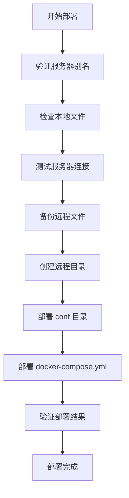

# HummingBot 配置部署指南

## 🚀 部署工具概述

本项目提供了简化的配置部署解决方案：

- **`deploy.sh`** - 主要部署脚本
- **SSH 配置** - 使用 ~/.ssh/config 管理服务器连接

## 📋 快速开始

### 1. 配置 SSH 连接

在 `~/.ssh/config` 文件中配置服务器连接信息：

```bash
# 编辑 SSH 配置
nano ~/.ssh/config

# 添加服务器配置
Host server1
    HostName 192.168.1.31
    User ubuntu
    Port 22
    IdentityFile ~/.ssh/id_rsa

Host server2
    HostName 192.168.1.32
    User ubuntu
    Port 22
    IdentityFile ~/.ssh/id_rsa
```

### 2. 生成配置

```bash
# 为指定服务器生成配置
python prepare.py ads_31
```

### 3. 部署配置

```bash
# 部署到服务器（SSH配置中的主机名必须与配置文件夹名相同）
./deploy.sh ads_31
```

## 🛠️ 详细使用说明

### 部署脚本使用

#### 基本部署
```bash
./deploy.sh ads_31
```

#### 测试 SSH 连接
```bash
ssh ads_31 "echo '连接成功'"
```

## 📁 部署内容

部署脚本会将以下文件上传到服务器的 `~/ex-bot/` 目录：

- **`conf/`** 目录 - 包含所有机器人配置文件
- **`docker-compose.override.yml`** - Docker Compose 配置文件

### 目录结构
```
~/ex-bot/
├── conf/
│   ├── bot1/
│   │   ├── controllers/
│   │   ├── scripts/
│   │   ├── strategies/
│   │   └── connectors/
│   └── bot2/
│       ├── controllers/
│       ├── scripts/
│       ├── strategies/
│       └── connectors/
└── docker-compose.override.yml
```

## 🔧 SSH 配置文件

### SSH 配置格式 (`~/.ssh/config`)

```bash
# SSH 服务器配置（主机名必须与配置文件夹名相同）
Host ads_31
    HostName 192.168.1.31
    User ubuntu
    Port 22
    IdentityFile ~/.ssh/id_rsa
    StrictHostKeyChecking no

Host ads_32
    HostName 192.168.1.32
    User ubuntu
    Port 22
    IdentityFile ~/.ssh/id_rsa
    StrictHostKeyChecking no
```

### 配置说明

- **Host**: SSH 连接别名，必须与配置文件夹名相同
- **HostName**: 服务器 IP 地址或域名
- **User**: SSH 登录用户名
- **Port**: SSH 端口（可选，默认为 22）
- **IdentityFile**: SSH 私钥文件路径
- **StrictHostKeyChecking**: 跳过主机密钥检查（可选）

## 🔐 SSH 配置

### 1. 生成 SSH 密钥对

```bash
ssh-keygen -t rsa -b 4096 -C "your_email@example.com"
```

### 2. 复制公钥到服务器

```bash
ssh-copy-id user@192.168.1.31
```

### 3. 测试连接

```bash
ssh ads_31 "echo '连接成功'"
```

## 🚨 故障排除

### 常见问题

#### 1. 连接被拒绝
```bash
# 检查服务器是否运行
ping 192.168.1.31

# 检查 SSH 服务状态
ssh ads_31 "systemctl status ssh"
```

#### 2. 权限被拒绝
```bash
# 检查 SSH 密钥
ssh-add -l

# 重新添加密钥
ssh-add ~/.ssh/id_rsa
```

#### 3. 文件传输失败
```bash
# 检查目标目录权限
ssh ads_31 "ls -la ~/ex-bot/"

# 检查磁盘空间
ssh ads_31 "df -h"
```

### 日志查看

部署过程中的详细信息会显示在终端中，包括：

- 文件传输进度
- 错误信息
- 部署结果确认

## 📊 部署流程



## 🔄 自动化部署

### 批量部署脚本示例

```bash
#!/bin/bash
# 批量部署脚本

SERVERS=("ads_31" "ads_32" "ads_33")

for server in "${SERVERS[@]}"; do
    echo "部署服务器: $server"

    # 生成配置
    python prepare.py "$server"

    # 部署配置
    ./deploy.sh "$server" --backup

    echo "服务器 $server 部署完成"
    echo "------------------------"
done
```

## 📝 最佳实践

1. **始终使用备份**: 部署前备份现有配置
2. **测试连接**: 部署前测试服务器连接
3. **预览部署**: 使用 `--dry-run` 预览操作
4. **分批部署**: 避免同时部署多个服务器
5. **验证结果**: 部署后检查文件是否正确传输

## 🆘 获取帮助

```bash
# 查看部署脚本帮助
./deploy.sh --help
```

这个部署系统为您的 HummingBot 多服务器管理提供了完整的解决方案！
